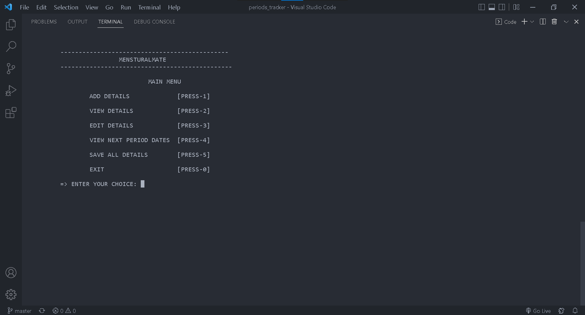

    

# MensturalMate

A simple menu driven period calculator build in C language as part of my mini-project in MCA Semester 1

## Run locally

To run this project, you need to install an IDE/Code Editor (<a href = "https://code.visualstudio.com/">Visual Studio Code</a> is preferable) and also a C/C++ compiler on your system. Some popular compilers are:
1. GCC on Linux
2. GCC via Mingw-w64 on Windows
3. Microsoft C++ compiler on windows
4. Clang for XCode on MacOS

Check out this <a href = "https://www.javatpoint.com/how-to-run-a-c-program-in-visual-studio-code"> link </a> to know how to run a C program in Visual Studio Code.

## Screenshot

